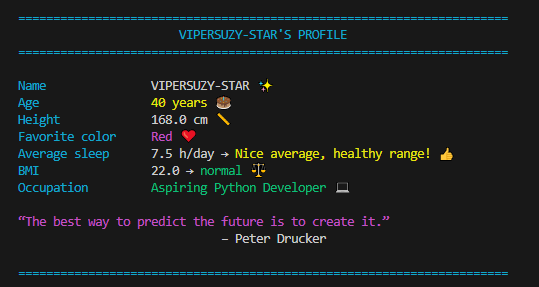

# Personal Info Formatter

A colorful console-based personal profile printer written in Python.  
Uses ANSI escape codes for colors, emojis for visual flair, and simple calculations like BMI and sleep quality feedback.

This is a beginner-friendly portfolio project demonstrating:

- Variables and data types
- f-strings
- Functions
- Conditional logic (if/elif/else)
- Basic math (BMI)
- ANSI terminal colors
- String manipulation

## Features

- Beautiful centered title frame in cyan
- Aligned fields with labels in cyan and values in custom colors
- Emojis next to each field
- Sleep quality feedback with color-coded message
- BMI calculation + category (underweight / normal / overweight / obese)
- Highlighted quote section
- Clean footer with credits

## Demo (example output)

## Example Output

