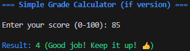

# Grade Calculator

A simple Python program that converts a numerical score (0–100) into a Hungarian-style grade (1–5) with encouraging feedback messages.  
Implemented in two versions to compare classic conditional logic with modern structural pattern matching.


## Features

Accepts scores as integers or decimals (e.g. 88.5)
Validates input: must be number between 0 and 100
Two implementation approaches:Classic if/elif/else
Modern match-case (Python 3.10+)

Colorful terminal output using ANSI escape codes
Friendly error messages for invalid input

## Grade Mapping

| Score     | Grade | Message (example)                          |
|-----------|-------|--------------------------------------------|
| ≥ 90      | 5     | Excellent! Very proud of you!           |
| ≥ 80      | 4     | Good job! Keep it up!                   |
| ≥ 70      | 3     | Satisfactory. Room for improvement.       |
| ≥ 60      | 2     | Passable. Study more next time!           |
| < 60      | 1     | Fail. Don't give up, keep practicing!   |

## How to Run

Make sure you have **Python 3.10 or higher** installed.
Clone or download this repository.
Navigate to the grade_calculator folder (or wherever you placed the scripts).
Run either version:bash

# If/elif/else version
python solution_if_version.py

# match-case version (recommended if using Python 3.10+)
python solution_match_version.py

## Project Structure

```

Python_portfolio/
<<<<<<< HEAD
└── TASK2_grade_calculator/
    ├── README.md                       # This documentation file
    ├── solution_if_version.py          # Classic if/elif/else version
    ├── solution_match_version.py       # Modern match-case version (Python 3.10+)
    ├── output_example_if.png           # Example output screenshot (if version)
    └── output_example_match.png        # Example output screenshot (match version)
```
=======
│
├── README.md
│
├── TASK1_personal_info_formatter/
│ ├── personal_info_formatter.py
│ ├── README.md
│ └── output_example.png
│
└── TASK2_grade_calculator/
├── solution_if_version.py
├── solution_match_version.py
├── README.md
├── output_example_if.png
└── output_example_match.png

>>>>>>> 51c85c9 (Add TASK3: Guess The Number Advanced game with screenshot)
## Example Output

### If / Elif / Else Version

---

### Match-Case Version (Python 3.10+)

## Author

Created by Babarci Szuzana  
Python learning portfolio project

